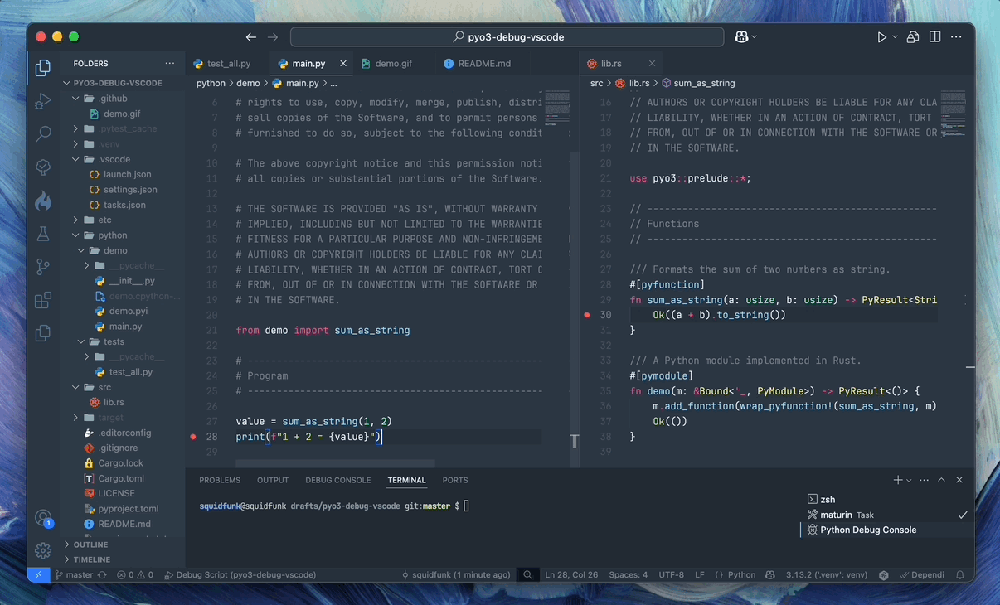

# Debugging PyO3 with Visual Studio Code

This is a sample project that shows how to debug [PyO3] extension using [Visual
Studio Code]. It allows to set breakpoints in Python sources and tests, as well
as in Rust sources, and step through Python and Rust code simultaneously. This
was tricky to set up, so I thought I'd share my configuration.



  [PyO3]: https://pyo3.rs
  [Visual Studio Code]: https://code.visualstudio.com/

## Prerequisites

This project assumes you have a Python and Rust toolchain up and running. In
Visual Studio Code, make sure you have the following extensions installed:

- [CodeLLDB]
- [Rust Analyzer]

  [CodeLLDB]: https://marketplace.visualstudio.com/items?itemName=vadimcn.vscode-lldb
  [Rust Analyzer]: https://marketplace.visualstudio.com/items?itemName=rust-lang.rust-analyzer

## Installation

Create a virtual environment and install the required packages:

```
python -m venv .venv
source .venv/bin/activate
pip install -r requirements.txt
```

## Usage

There are two launch configurations:

1. __Debug Script__: Debug the current active Python script. This is the most
   common use case. You can set breakpoints in Python code and step through it.

2. __Debug Test__: Debug the current active Python test. It assumes that you are
   using [pytest] as your test runner. You can set breakpoints in Python code
   and step through it.

  [pytest]: https://docs.pytest.org/en/stable/

